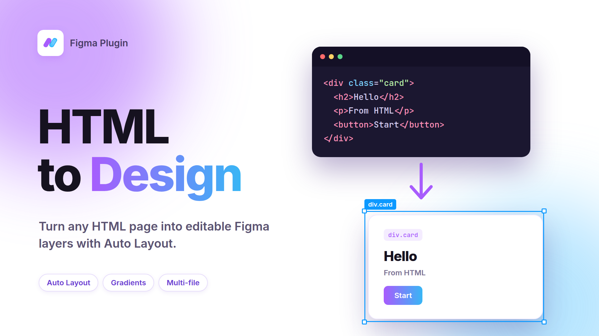

# HTML to Figma

> 크레딧도, 횟수 제한도 없는 HTML → Figma 디자인 변환 플러그인.
> HTML 파일을 Auto Layout·그라디언트·가상 요소까지 살려서 편집 가능한 Figma 레이어로 바꿉니다.

<p align="center"></p>

## 왜 만들었나

Figma에 이미 HTML → Figma/Design 플러그인이 여러 개 있지만, 직접 써 보니 두 가지가 문제였습니다.

1. **렌더링이 제대로 안 된다.** 체크박스가 사라지고, 텍스트가 엉뚱하게 줄바꿈되고, 그라디언트나 배경 이미지, `::before`/`::after`, 목록 기호가 빠졌습니다.
2. **무료 크레딧만 주고 이후에는 돈을 받는다.** 몇 번 쓰고 나면 횟수 제한이 걸리고, 그 제한을 푸는 게 유료 결제였습니다.

HTML을 Figma로 옮기는 일은 브라우저가 이미 계산해 놓은 결과를 읽어서 Figma 노드로 번역하는 일이라, 서버도 크레딧도 필요 없습니다. 그래서 **전부 로컬에서 돌아가고 횟수 제한이 없는** 플러그인을 직접 만들었습니다.

## 어떤 기능을 하나

| 기능 | 설명 |
|---|---|
| 파일 업로드 | `.html` 파일을 끌어놓거나 선택. 여러 개도 가능 |
| 여러 파일 배치 | 파일마다 프레임을 만들고, 오른쪽으로 20px 간격을 두고 이어서 배치. 첫 프레임은 현재 화면 중앙에 생성 |
| 붙여넣기 | HTML 코드를 직접 붙여넣어도 변환 |
| 크기 | `Auto`(렌더된 크기 100%)이거나, 너비·높이를 직접 지정 |
| Auto Layout | `display:flex`(방향, gap, padding, 정렬, wrap)와 세로로 쌓인 블록을 Figma Auto Layout으로 변환 |
| 레이어 이름 | `태그#id.class` 규칙(예: `div.card`). `data-figma-name` 속성으로 덮어쓰기 가능 |
| 스타일 | 배경색, 테두리, 둥근 모서리, 그림자, 투명도 |
| 그라디언트 | `linear-gradient`, `radial-gradient`, 여러 겹 배경, 그라디언트 글자(`background-clip:text`) |
| 이미지 | ``, CSS 배경 이미지(cover/contain/타일/위치 지정), `<canvas>`, `<svg>` |
| 브라우저 기본 컨트롤 | 체크박스, 라디오, 텍스트 입력창, textarea, select |
| 가상 요소 | `::before`, `::after` |
| 목록 기호 | `•`, `◦`, `1.`, `a.`, `I.` 등 |
| 폰트 | CSS `font-family` 목록에서 Figma에 있는 첫 폰트를 사용. 없으면 Inter |

## 설치 및 사용

1. Figma **데스크톱 앱**에서 `Plugins → Development → Import plugin from manifest…`
2. 이 폴더의 `manifest.json` 선택
3. `Plugins → Development → HTML to Figma` 실행
4. HTML 파일을 올리고, 크기(Auto 또는 W/H)를 정한 뒤 **가져오기**

> `manifest.json`을 수정한 뒤에는 다시 Import 해야 반영될 수 있습니다.

## 파일 구조

```
html-to-figma/
├─ manifest.json   플러그인 메타 정보 (진입점, 네트워크 권한)
├─ code.js         메인 스레드: Figma API로 노드를 생성
├─ ui.html         UI iframe: 파일 입력, HTML 렌더링, DOM 분석
├─ icon.png        게시용 아이콘 (128×128)
├─ thumbnail.png   게시용 썸네일 (1920×1080)
└─ sample.html     동작 확인용 샘플
```

빌드 도구 없이 파일 세 개(`manifest.json`, `code.js`, `ui.html`)만으로 동작합니다.

## 동작 로직

### 왜 두 파일로 나뉘나

Figma 플러그인은 서로 다른 두 환경에서 돌아가고, 둘은 `postMessage`로만 대화합니다.

| | `code.js` (sandbox) | `ui.html` (iframe) |
|---|---|---|
| Figma API (`figma.*`) | O | X |
| DOM, `getComputedStyle` | X | O |

HTML을 해석하려면 브라우저가 계산한 레이아웃(위치, 크기, 폰트)이 필요하고, 노드를 만들려면 Figma API가 필요합니다. 이 둘이 서로 다른 곳에 있어서 **UI에서 분석하고, 메인 스레드에서 만드는** 구조가 됩니다.

### 변환 파이프라인

```
HTML 파일(여러 개)
  │ ① 숨겨진 iframe에 렌더링 (웹폰트 로딩 대기)
  ▼
브라우저가 계산한 레이아웃
  │ ② 가상 요소를 <span>으로 펼치기 → DOM을 돌며 위치·스타일 수집
  ▼
중간 트리(JSON)  { type, x, y, w, h, fill, layers, layout, children }
  │ ③ postMessage
  ▼
code.js
  │ ④ createFrame / createText / createNodeFromSvg 로 노드 생성
  ▼
Figma 캔버스
```

**왜 HTML을 직접 파싱하지 않고 렌더링하나?** CSS는 상속, 단위 변환, 레이아웃 계산이 복잡해서 직접 구현하면 어긋납니다. 브라우저가 이미 계산한 결과(`getBoundingClientRect`, `getComputedStyle`)를 읽으면, 원본과 같은 위치·크기를 얻을 수 있습니다.

### 단계별 로직과 이유

| 단계 | 하는 일 | 왜 이렇게 했나 |
|---|---|---|
| 크기 결정 | Auto는 `<meta viewport>` 폭, 없으면 본문 폭, 그것도 없으면 1440px로 렌더 후 실제 크기를 측정 | "렌더된 크기 100%"를 재현하기 위해 |
| 텍스트 | `Range.getClientRects()`로 줄 단위 위치를 재고, 한 줄이면 자동 너비, 여러 줄이면 고정 너비. `line-height` 차이만큼 y 보정 | 폰트 폭이 조금만 달라도 고정 너비면 강제 줄바꿈되기 때문 |
| 폰트 | `font-family` 목록에서 Figma에 있는 첫 폰트를 고르고, 굵기에 맞는 스타일을 선택 | 전부 Inter로 그리면 원본과 인상이 달라지기 때문 |
| Auto Layout | `display:flex`의 방향·gap·padding·정렬을 그대로 옮기고, 실제로 여러 줄일 때만 wrap. 블록은 세로로 균일하게 쌓인 경우에만 변환. `position:absolute`는 절대 위치 | 조건이 안 맞는데 강제로 변환하면 배치가 깨지기 때문 |
| 브라우저 기본 컨트롤 | 체크박스, 라디오, select, 입력창을 `checked`, `disabled`, `accent-color` 값을 읽어서 도형과 체크 표시로 직접 그림 | 이 컨트롤은 브라우저가 그리는 것이라 DOM에 도형이 없어서, 그냥 변환하면 사라지기 때문 |
| 가상 요소 | `::before`/`::after`를 같은 스타일의 진짜 `<span>`으로 바꿔 끼운 뒤 측정하고, 원래 것은 `content:none !important`로 끔 | 가상 요소는 `getBoundingClientRect`로 측정할 수 없기 때문 |
| 목록 기호 | 목록 종류와 순서를 계산해서 텍스트로 만들어, 왼쪽 바깥에 붙임 | `::marker`도 DOM에 없기 때문 |
| 그라디언트 | CSS 각도와 그라디언트 선 길이로 Figma의 2×3 변환 행렬(`gradientTransform`)을 계산 | Figma는 각도가 아니라 행렬을 받기 때문 |
| 배경 이미지 | cover/contain/타일은 채우기로, 반복 없는 위치 지정 이미지는 별도 이미지 프레임으로 만들고 부모를 clip | 위치와 크기를 정확히 재현하기 위해 |
| 첫 프레임 위치 | `figma.viewport.center`(현재 화면 중앙) | 플러그인 API는 마우스 커서 좌표를 제공하지 않아서 |

## 알려진 한계

- CSS grid는 Auto Layout으로 변환하지 않습니다(위치가 고정된 프레임으로 유지).
- `repeating-*-gradient`, `conic-gradient`, `counter()` 번호는 지원하지 않습니다.
- 그라디언트 패턴 타일(작은 `background-size` 반복)은 지원하지 않습니다.
- 폰트: 원본과 같은 폰트가 Figma에 없으면 다른 폰트로 대체되어 글자 폭이 조금 달라질 수 있습니다.
- `::before`/`::after`를 `<span>`으로 바꾸는 방식이라, 그 요소의 자식에 걸린 `:first-child` 같은 스타일이 어긋날 수 있습니다.
- 상대 경로 이미지(`./img.png`)는 불러올 수 없습니다. 절대 URL이나 `data:` URL을 사용하세요.
- 네트워크 권한을 모든 도메인(`*`)으로 열어 두었습니다. 외부 이미지·웹폰트를 불러오기 위한 것이며, 공개 게시 시에는 심사에서 좁히라고 할 수 있습니다.

## 기여

이슈와 PR 환영합니다. 렌더링이 원본과 다른 HTML이 있으면, 그 HTML과 브라우저 화면, Figma 결과를 함께 올려 주세요.
